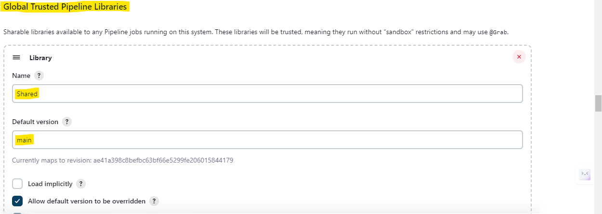
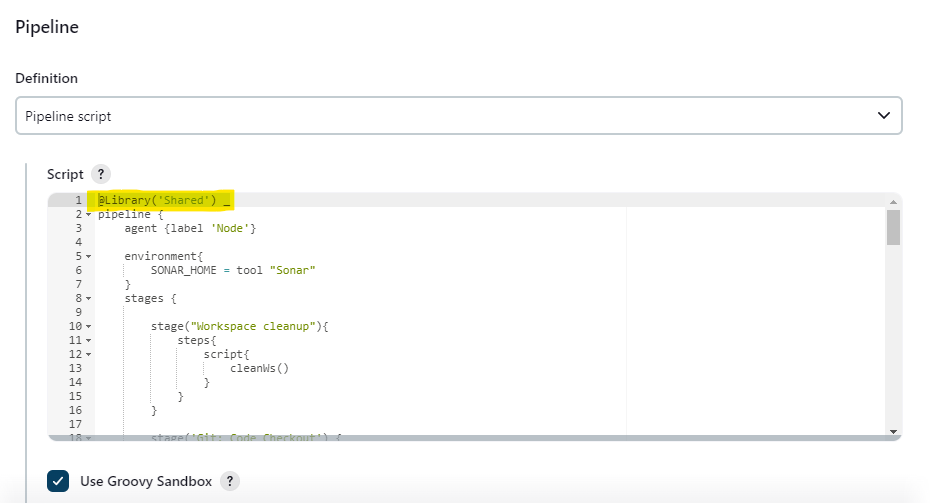

# Jenkins Shared Library

A reusable **Jenkins Shared Library** for creating clean, consistent, and maintainable CI/CD pipelines.

This repository contains reusable Groovy-based pipeline functions that can be shared across multiple Jenkins projects.

The purpose of the library is to move commonly repeated CI/CD logic out of individual Jenkinsfiles and maintain it in one central location.

## What is a Jenkins Shared Library?

A Jenkins Shared Library is a collection of reusable Jenkins Pipeline code.

Instead of writing the same CI/CD logic in every project's Jenkinsfile, common functionality can be implemented once in a Shared Library and reused across multiple pipelines.

This helps with:

- Code reuse
- Pipeline standardization
- Easier maintenance
- Cleaner Jenkinsfiles
- Consistent CI/CD practices
- Centralized improvements

The library is designed to be **generic and configurable**, so individual projects can provide their own values and requirements without modifying the shared implementation.

---

## Repository Structure

The reusable pipeline steps are maintained under the `vars/` directory.

Each `.groovy` file in `vars/` can expose a reusable Jenkins Pipeline step.

The library will evolve over time as additional reusable CI/CD functionality is added.

---

# Jenkins Setup

## 1. Add the Repository to Jenkins

Open:

**Jenkins → Manage Jenkins → System**

Find:

**Global Trusted Pipeline Libraries**

Add a new library.

Configure:

- **Name:** `Shared`
- **Default version:** `main`
- **Retrieval method:** Modern SCM
- **SCM:** Git
- **Project repository:** Your GitHub repository URL

For a private repository, configure the appropriate Jenkins Git credentials.

For a public repository, credentials are generally not required.

### Global Trusted Pipeline Library Configuration



The library name configured in Jenkins must match the name used when importing the library in the Jenkinsfile.

---

### 2. Use the Library in a Jenkinsfile
 
Import the library at the beginning of the Jenkinsfile:
 
```groovy
@Library('Shared') _
```
 
Then call any of the reusable steps from `vars/` inside your pipeline stages.
 
 
#### Pipeline Configuration in Jenkins
 

 
Make sure **Use Groovy Sandbox** is checked when using `Pipeline script` as the job definition, unless the library has been explicitly marked as trusted (as configured under Global Trusted Pipeline Libraries above).
 
---
 
## Author
 
**Anant Chaudhary**
 
- GitHub: [github.com/Anantch2005](https://github.com/Anantch2005)
- LinkedIn: [linkedin.com/in/anant-chaudhary-b743a52a3](https://linkedin.com/in/anant-chaudhary-b743a52a3)

Contributions, issues, and suggestions are welcome — feel free to open a pull request or an issue on the repository.
